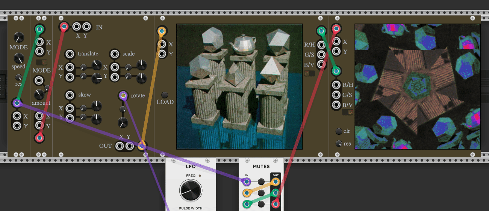

# Visions

Visions is a VCV Rack 2 plugin for video synthesis.

# Modules

## VideoOut

The VideoOut module draws sound data on the screen. In each (audio) frame it draws a pixel with a given position and colour. This can be used like a scope, or by setting up the position input to scan across the whole image. It can display the resulting image in a separate resizable window.

| Input | Description |
|-------|-------------|
| Position | Two-channel polyphonic input, channel 0 is the X-position to draw a pixel at and channel 1 is the Y-position. If this is connected it overrides the individual X and Y inputs. |
| X | X-position to draw a pixel at. If the polyphonic position input is connected this will be ignored in favour of the X value from that. |
| Y | Y-position to draw a pixel at. If the polyphonic position input is connected this will be ignored in favour of the Y value from that. |
| Colour | Three-channel polyphonic input for the colour to draw. The three channels are red, green and blue or hue, saturation and value depending on the RGB/HSV control switch. If this is connected it overrides the individual colour channel inputs. |
| R/H | Red or hue to draw, depending on the RGB/HSV control switch. If the polyphonic colour input is connected this will be ignored in favour of the R/H value from that. |
| G/S | Green or saturation to draw, depending on the RGB/HSV control switch. If the polyphonic colour input is connected this will be ignored in favour of the G/S value from that. |
| B/V | Blue or value to draw, depending on the RGB/HSV control switch. If the polyphonic colour input is connected this will be ignored in favour of the B/V value from that. |

| Control | Description |
|---------|-------------|
| RGB or HSV | Switch determining whether to interpret the three-channel colour input as red, green, blue or hue, saturation, value. |
| Bi/Unipolar Colour | Switch determining whether to expect -5v to 5v or 0v to 10v for colour inputs. |
| Bi/Unipolar Position | Switch determining whether to expect -5v to 5v or 0v to 10v for position inputs. |
| Window | Button to open a separate resizable window displaying the output. |
| Clear | Button to clear the screen. |
| Resolution | Control the amount of pixels the screen has. The number is the side length of the screen. |

## ImageIn

The ImageIn module reads sound data from an image file. It generates output representing the colour of the pixel at a given position.

| Input | Description |
|-------|-------------|
| Position | Two-channel polyphonic input, channel 0 is the X-position to read a colour from and channel 1 is the Y-position. If this is connected it overrides the individual X and Y inputs. |
| X | X-position to read a colour from. If the polyphonic position input is connected this will be ignored in favour of the X value from that. |
| Y | Y-position to read a colour from. If the polyphonic position input is connected this will be ignored in favour of the Y value from that. |

| Control | Description |
|---------|-------------|
| Load | Button to load an image file. |
| RGB or HSV | Switch determining whether to format the colour output as red, green, blue or hue, saturation, value. |
| Bi/Unipolar Colour | Switch determining whether to generate -5v to 5v or 0v to 10v colour outputs. |
| Bi/Unipolar Position | Switch determining whether to expect -5v to 5v or 0v to 10v for position inputs. |

| Output | Description |
|--------|-------------|
| Colour | Three-channel polyphonic output for the colour at the given point. The three channels are red, green and blue or hue, saturation and value depending on the RGB/HSV control switch. |
| R/H | Red or hue at the given point, depending on the RGB/HSV control switch. |
| G/S | Green or saturation at the given point, depending on the RGB/HSV control switch. |
| B/V | Blue or value for at the given point, depending on the RGB/HSV control switch. |

## PathGenerator

The PathGenerator module is a synced pair of oscillators designed to produce position data for scanning over the entire space used by ImageIn and VideoOut. Its simplest use case is to connect its output to the position inputs of both, and connect the colour output of the ImageIn to the colour input of the VideoOut via some effects.

To be absolutely strictly correct, in a simple setup with just an ImageIn and a VideoOut tied together with a PathGenerator, the position signal from the PathGenerator to the VideoOut must be delayed by one frame so it hits the VideoOut in the same frame that the VideoOut is reporting the values it got from reading that position last frame. With more complex signal paths there may be a different offset. It doesn't make a huge difference in most modes (except random), but the PreciseDelay module is provided for this purpose.

| Control | Description |
|---------|-------------|
| Mode | Four options for the path to scan over the image. Scanning: left to right, top to bottom. Boustrophedon: Alternating left to right then back again right to left, going top to bottom. Spiral: a square spiral out from the centre. Random: pick pixels at random. |
| Speed | Speed the scanning head moves, or in the case of random mode, probability of the scanning head moving. |
| Resolution | how many lines to scan. If plugged into a VideoOut, should generally be similar to the resolution of that module. |
| Bi/Unipolar Position | Switch determining whether to generate -5v to 5v or 0v to 10v position outputs. |

| Output | Description |
|--------|-------------|
| Position | Two-channel polyphonic output, channel 0 is the X-position and channel 1 is the Y-position. |
| X | X-position. |
| Y | Y-position. |

## CoordinateFolder

The CoordinateFolder module takes a position and folds it onto a subset of the plane, either square or radial. It can be used to produce tiled or kaleidoscopic effects.

| Input | Description |
|-------|-------------|
| Position | Two-channel polyphonic input, channel 0 is the X-position and channel 1 is the Y-position. If this is connected it overrides the individual X and Y inputs. |
| X | X-position. If the polyphonic position input is connected this will be ignored in favour of the X value from that. |
| Y | Y-position. If the polyphonic position input is connected this will be ignored in favour of the Y value from that. |
| Amount CV | Modulates the Amount control, proportionally to the Amount Modulation control. |

| Control | Description |
|---------|-------------|
| Mode | Two options. Square: divide the XY plane into a square grid and map each square onto the one whose top left corner is at the origin. Radial: divide the XY plane into radial segments and map each one onto the one on the positive side of 0 degrees. |
| Amount | how many sections to divide the plane into. |
| Amount Modulation | How much influence the Amount CV input should have on the Amount value. |

| Output | Description |
|--------|-------------|
| Position | Two-channel polyphonic output, channel 0 is the X-position and channel 1 is the Y-position. |
| X | X-position. |
| Y | Y-position. |

## AffineTransform

The AffineTransform module is a fully voltage-controllable affine transform on 2d vectors. Applies operations in the order they appear on the panel: translate, scale, skew, rotate.

| Input | Description |
|-------|-------------|
| Position | Two-channel polyphonic input, channel 0 is the X-position and channel 1 is the Y-position. If this is connected it overrides the individual X and Y inputs. |
| X | X-position. If the polyphonic position input is connected this will be ignored in favour of the X value from that. |
| Y | Y-position. If the polyphonic position input is connected this will be ignored in favour of the Y value from that. |
| Translate Polyphonic | Two-channel polyphonic input, channel 0 is the translation in the X-axis and channel 1 is the Y-axis. If this is connected it overrides the individual X and Y inputs. |
| Translate X | Translation in the X-axis. If the polyphonic position input is connected this will be ignored in favour of the X value from that. |
| Translate Y | Translation in the Y-axis. If the polyphonic position input is connected this will be ignored in favour of the Y value from that. |
| Scale Polyphonic | Two-channel polyphonic input, channel 0 is the scaling along the X-axis and channel 1 is the Y-axis. If this is connected it overrides the individual X and Y inputs. |
| Scale X | Scaling along the X-axis. If the polyphonic position input is connected this will be ignored in favour of the X value from that. |
| Scale Y | Scaling along the Y-axis. If the polyphonic position input is connected this will be ignored in favour of the Y value from that. |
| Skew Polyphonic | Two-channel polyphonic input, channel 0 is the skew along the X-axis and channel 1 is the Y-axis. If this is connected it overrides the individual X and Y inputs. |
| Skew X | Skew along the X-axis. If the polyphonic position input is connected this will be ignored in favour of the X value from that. |
| Skew Y | Skew along the Y-axis. If the polyphonic position input is connected this will be ignored in favour of the Y value from that. |
| Rotation | Rotation around the origin. |

| Control | Description |
|---------|-------------|
| Translate X | Translation in the X-axis. |
| Translate X Modulation | How much the Translate X input should affect the Translate X control value. |
| Translate Y | Translation in the Y-axis. |
| Translate Y Modulation | How much the Translate Y input should affect the Translate Y control value. |
| Scale X | Scaling along the X-axis. |
| Scale X Modulation | How much the Scale X input should affect the Scale X control value. |
| Scale Y | Scaling along the Y-axis. |
| Scale Y Modulation | How much the Scale Y input should affect the Scale Y control value. |
| Skew X | Skew along the X-axis. |
| Skew X Modulation | How much the Skew X input should affect the Skew X control value. |
| Skew Y | Skew along the Y-axis. |
| Skew Y Modulation | How much the Skew Y input should affect the Skew Y control value. |
| Rotation | Rotation around the origin. |
| Rotation Modulation | How much the Rotation input should affect the Rotation control value. |

| Output | Description |
|--------|-------------|
| Position | Two-channel polyphonic output, channel 0 is the X-position and channel 1 is the Y-position. |
| X | X-position. |
| Y | Y-position. |

## PreciseDelay

The PreciseDelay module delays signals by a small number of (audio) frames. The delay is generally too short to hear, but it can be used for instance to line up the coordinates going into a VideoOut with the coordinates going into a corresponding ImageIn. Each module any signal passes through delays it by at least one frame, and for video synth purposes sometimes frame-perfect timing is important.

| Input | Description |
|-------|-------------|
| Input A-F | Optionally-polyphonic signals |

| Control | Description |
|---------|-------------|
| Delay A-F | Amount of audio frames to delay by. Depending on your settings, each frame is probably about 1/44100th of a second. |

| Output | Description |
|--------|-------------|
| Output A-F | Delayed signals, with the same polyphony as their corresponding inputs |
